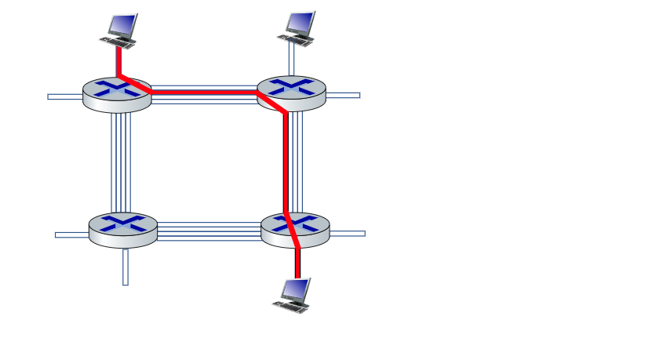
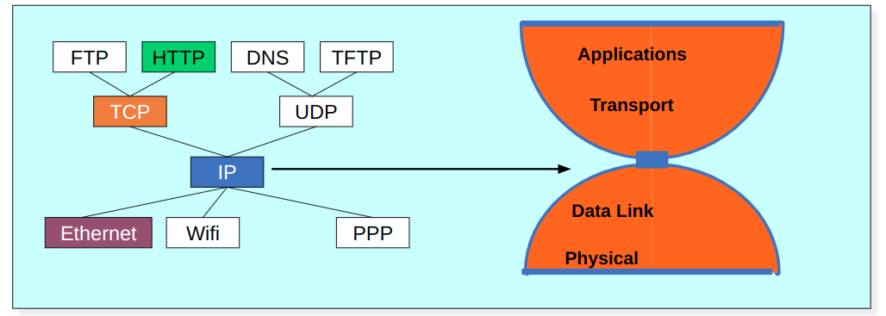
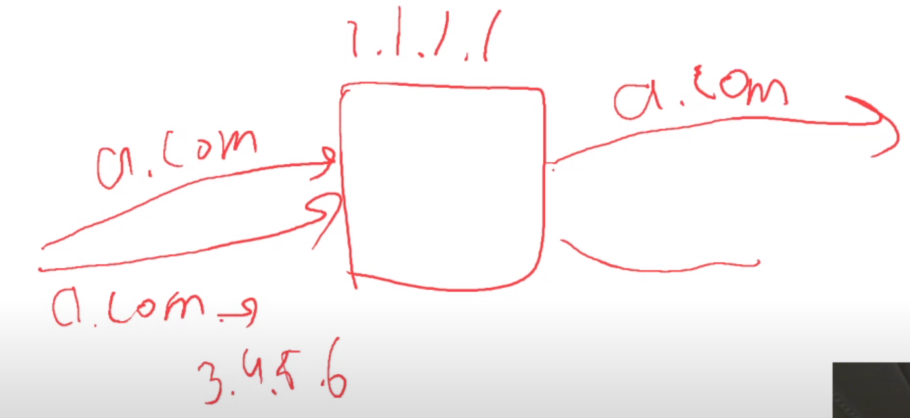
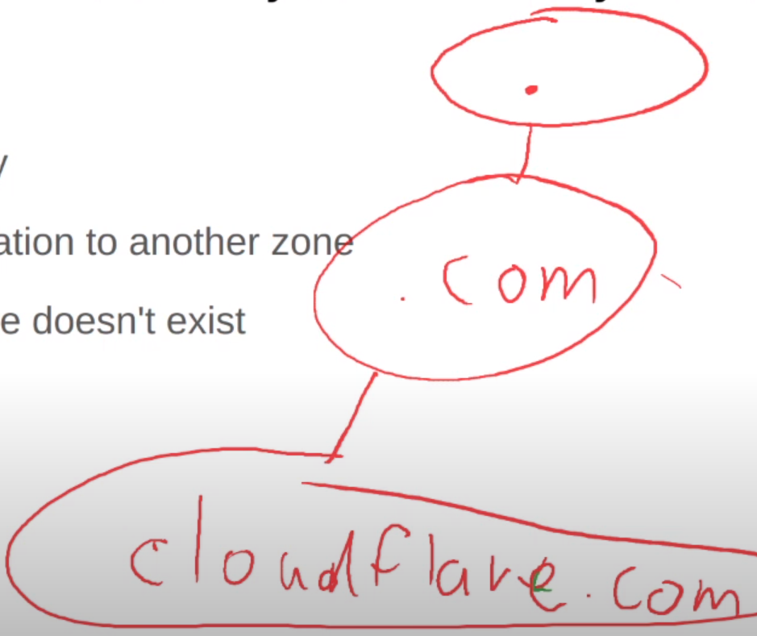
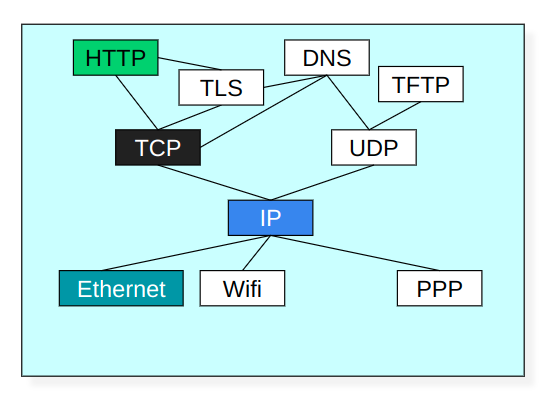
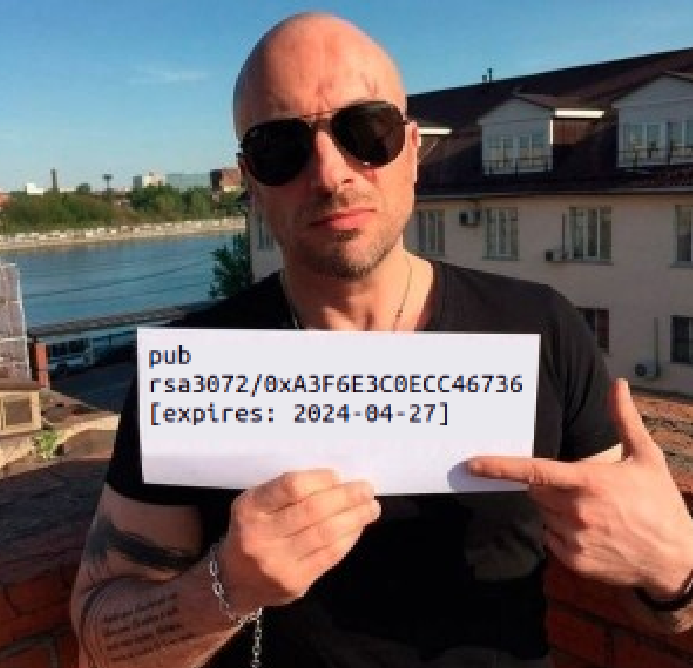
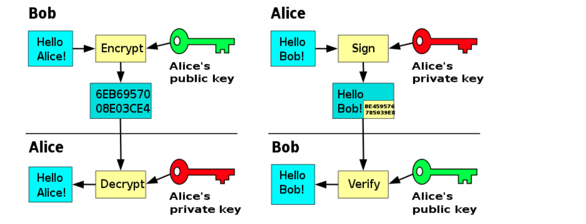
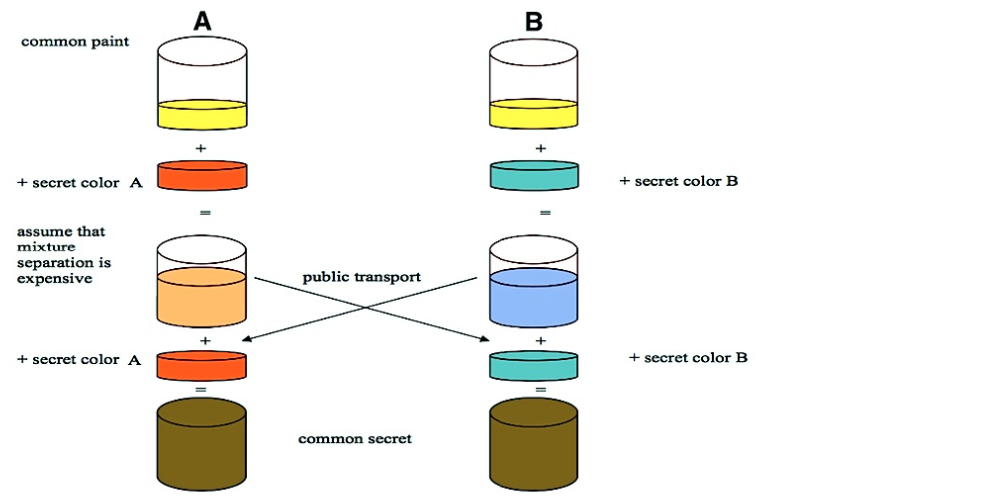
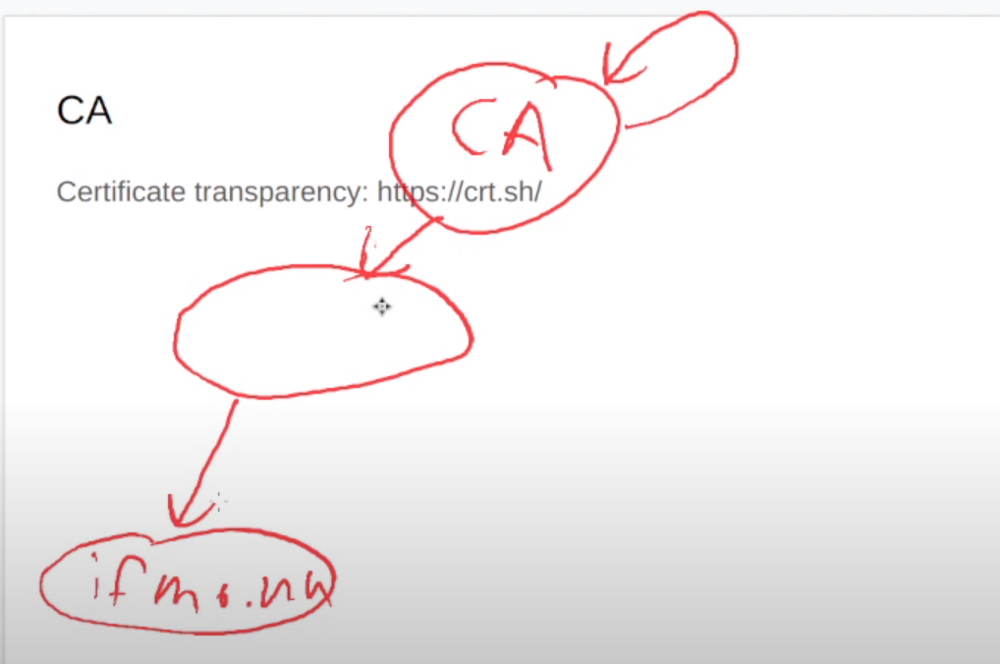
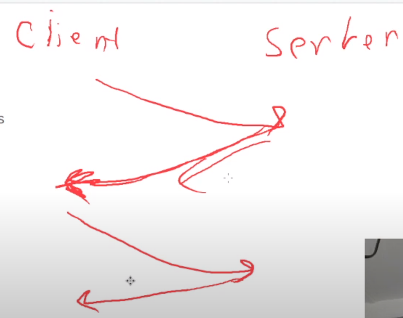

# Конспект курса Компьютерные сети

# Лекция 1
[Youtube](https://youtu.be/jzvWO9u1t9I)

Полезная литература:
- *Computer Networks.
Andrew Tanenbaum, David Wetherall*
- *Computer Networking: A Top-down Approach.
  Jim Kurose*

## Как заставить компьютеры общаться?
### 1 способ
Соединить их проводом.

Проблема - N^2 проводов.
### 2 способ. Circuit Switching
Поставить промежуточные узлы, которые будут замыкать провода. Называется "Канальная коммутация"

Проблема - большую часть времени канал простаивает. Мы передали сообщения и больше ничего не делаем, хотя используем канал. Хочется, чтобы через один канал общалось сразу несколько пользователей.
### 3 способ. Packet switching
Разобьем данные на маленькие пакеты, в которых напишем, от кого и кому они предназначены. Пакеты достаточного маленького размера (обычно не больше 1.5 Кб), поэтому по проводу передаются быстро.

Решили основную проблему - теперь каналы не простаивают.
## Немножко терминологии
- Hosts, Хосты - устройства, посылающие данные. Располагаются в "листьях" графа интернета: телефоны, компьютеры.
- Packet switches, коммутаторы - пересылают пакеты
- Communication links - соединения, линки, через которые идут данные
- Networks, сети - множество устройств, коммутаторов, линков, управляемые одной организацией

**Интернет - объединение многих независимых сетей, которые как-то общаются друг с другом**

## Скорость передачи данных
### Capacity, link bandwidth, link transmission rate
Кол-во бит в секунду, которое способно передавать соединение. Ограничивается например тем, что чтобы передать сигнал по оптоволокну, нужно светить какое-то продолжительное время.
### Packet transmission delay
Задержка между отправлением и получением первого пакета данных.

Ограничивается:
- Скоростью света. Нельзя передать сигнал в Америку из России быстрее 200мс
- Размером пакета и link bandwidth

*packet transmission delay = packet size / transmission rate*

Пакеты обычно начинают передавать, получив их полностью. Поэтому время для передачи пакетов ограничивается снизу
```
числом узлов * packet transmission delay
```
Поэтому чем больше узлов тем хуже.

## Link, Линки
### Витая пара
Два разделенных медных провода.
- Category 5: 100 Mbps, 1 Gbps Ethernet
- Category 6: 10 GBps Ethernet


### Coaxial cable


На заре интернета много работало через коаксиальный кабель.
### Fiber optic cable, Оптика

Стекловолокно, по которому летят фотоны.
- Высокая скорость
  - 10's-100's Gbps
- Low error rate. Устойчивость к помехам
  - Иммунитет к электромагнитному шуму
  - Повторители расположены далеко друг от друга.

### Wireless radio. Беспроводная связь
- Передача сигнала по воздуху
- Чувствителен к отражениям, преграждающим путь предметам. другому шуму.

Виды:
- Wireless LAN (WiFi)
  - 10-100's Mbps; 10's of meters
- wide-area (4G, 5G cellular)
  - 10's Mbps over ~10 Km (c 5G гораздо больше)
- Bluetooth: замена кабелям
  - short distances, limited rates
- terrestrial microwave.
  - point-to-point; 45 Mbps channels
- satellite
- up to 45 Mbps per channel
  - 270 msec end-end delay (Starlink быстрее)

## Две задачи в компьютерных сетях
Forwarding и Routing (маршрутизация)
- Forwarding - локальное принять решение, кому переслать пакет дальше. Коммутатор, занимающийся форвардингом может не знать о глобальном устройстве сети.
- Routing - нахождение глобальных путей между отправителем и получателем. Создание таблиц маршрутизации.

## Packet-switching: queueing.

В роутерах есть буфер-очередь для пакетов. Если пакеты приходят быстрее, чем роутер может их переслать, то они неизбежно начнут теряться.

Поэтому нужно регулировать скорость отправки пакетов. Эта проблема называется **Congestion control**. Ей занимается ряд протоколов, например, TCP.

## Протокол
Протокол - договор между двумя или более сторонами (программами, людьми, узлами) о том, как им общаться друг с другом.

### Откуда берутся протоколы? Интернет стандарты
- RFC: Request for Comments
- IETF: Internet Engineering Task Force
- ISO: International Organization for Standardization

Обычно умные люди собираются и придумывают новый стандарт, но он помечается как черновик, draft. И дальше может собраться еще одна группа умных людей, и утвердить предложенный стандарт.

## Layered Internet protocol stack
Слоеный стек интернет-протоколов.
- **application:** То, ради чего происходит общение.
  - HTTP, IMAP, SMTP, DNS
- **transport:** process-process data transfer. Передача данных.
  - TCP, UDP
- **network:** транспортировка пакетов от отправителя до получателя.
  - IP, routing protocols
- **link:** передача данных между соседними узлами сети
  - WiFi, Ethernet, PPP
- **physical:** биты "по проводу"

Дальше в курсе будет рассказано о границе между *physical* и *link*. Вкратце, link это логический уровень.

### Модель песочных часов

На самом деле DNS может работать поверх TCP, а HTTP поверх UDP, и др.

### ISO/OSI model (ЭМВОС)
- L7: application
- L6: presentation
- L5: session
- L4: transport
- L3: network
- L2: link
- L1: physical

Модель была придумана до создания интернета, поэтому она не совсем соответствует тому, как он работает.

Смысл разделения всего на слои в том, чтобы разные слои могли работать, не зная про внутреннее устройство друг друга. HTTP не важно, он доставляет сообщения через WiFi или Ethernet. А IP пакетам не важно, что лежит внутри них (UDP или TCP).

Хотя, часто бывает, что протоколы лезут не на свой уровень. Например, протокол L2 смотрит на IP адрес.

# Лекция 6
[YouTube](https://www.youtube.com/watch?v=iU1it7T93Tw&list=PLd7QXkfmSY7bh7nHfBbeQDIUUWueQja_4&index=6)

## Как выглядит интернет с точки зрения провайдера?


*TODO:* упомянуть термин BGP-сессия

Вы подключены к провайдеру (RiNet) и хотите получить доступ ко всему (или части) интернета. Как RiNet-у доставить до вас трафик?

**Важно: RiNet - [автономная система](https://ru.wikipedia.org/wiki/%D0%90%D0%B2%D1%82%D0%BE%D0%BD%D0%BE%D0%BC%D0%BD%D0%B0%D1%8F_%D1%81%D0%B8%D1%81%D1%82%D0%B5%D0%BC%D0%B0_(%D0%98%D0%BD%D1%82%D0%B5%D1%80%D0%BD%D0%B5%D1%82))**.

Допустим, вы хотите обмениваться трафиком с Google.

Есть три способа:
1. Подключить RiNet к большому провайдеру (Rostelecom), у которого есть *BGP FullView* (путь до любой другой автономной системы).
   - `+` Доступ в весь интернет
   - `-` И провайдер, и Google должны платить ростелекому.
2. Проложить кабель (например, оптику) напрямую между RiNet и Google. В таком случае они налаживают Пиринг (Peering).
   - `+` Скорость, короткий путь
   - `+` Не нужно платить ростелекому
   - `-` Прокладывать кабель сложно
   - `-` Не факт, RiNet настолько интересен Гуглу, чтобы он согласился соединить себя с ним.
3. Internet Exchange. Например MSK-IX, SPB-IX.
   - `+` Дешевле, чем через Ростелеком
   - `-` Доступ только до **части** сетей, ограниченный тем, кто подключен к данной точке IX.

### Как провайдер общается с далеко расположенными сетями (на другом континенте)?

Есть примерно 5 [тир-1 провайдеров](https://en.wikipedia.org/wiki/Tier_1_network). Среди них:
   - Cogent
   - Level 3
   - Cable & Wireless

Тир-1 провайдеры соединены друг с другом, и к ним подключены все в интернете, за деньги. Они предоставляют связность интернета.

Но пара провайдеров может сэкономить, и воспользоваться каким-нибудь IX. На сайте [hurricane electric](https://bgp.he.net/) можно посмотреть, к каким IX подключен, например, Ростелеком (и много всего другого).

## Блокировки
Большинство маленьких провайдеров соединены с "интернетом" через несколько больших провайдеров: МТС, Мегафон, Ростелеком. Поэтому популярная практика блокировать IP-адреса через этих больших провайдеров.

*Если у вас внезапно заработал Instagram, вполне возможно что у вашего провайдера есть стык с Facebook не через Ростелеком и т.п.*

### Как блокировать DNS?
1. Запросы к DNS-серверу очень легко отличить, и провайдер может отвечать вам просто неправильным IP-адресом. Это можно обойти, используя *DNS over SSL*, *DNS over HTTPS*.
2. Провайдер может посмотреть, в какие адреса резолвится нежелательный сайт, и заблокировать их.
3. Бывает так, что на одном IP-адресе располагается несколько сайтов, и хочется блокировать лишь некоторые из них. Для этого необходимо лезть внутри IP-пакета. HTTPs шифрует все, кроме названия сайта. Поэтому блокировщик может профильтровать пакеты по вхождению названия.

   *Примечание: это зависит не только от вас, но и от сервера, к которому подключаетесь. Есть протоколы, позволяющие шифровать имя сайта, но они не распространены, поэтому пока что они не помогут.*
4. Использовать фрагментацию IP-пакетов, чтобы разрезать имя сайта и положить в два пакета.

### Как блокируют в зависимости от содержимого пакета?


**Технические средства противодействия угрозам**

Их могут подключать к провайдеру, и пропускать через них трафик. Дальше происходит [Deep Packet Inspection](https://en.wikipedia.org/wiki/Deep_packet_inspection). В случае срабатывания фильтра устройство сообщает провайдеру дропнуть данный пакет. Эти устройства видят то, что находится в IP-пакете.
- Если это HTTPS, то видны название сайта и IP-адрес получателя.
- Если HTTP, то видно все :)

Так работал великий китайский файрвол.

### Обход блокировок
**VPN**. В месте за пределами файрвола разворачивается VPN-сервер. Устанавливается соединение, эмулирующее линк на уровне L2, и уже оттуда отправляются пакеты. Стоит понимать, что VPN траффик довольно легко отличить от обычного. Поэтому его можно блокировать:
- Новые / маленькие VPN протоколы блокировать нетрудно
- Старые / большие, такие как IpSec, OpenVPN не блокируют, потому что ими пользуются компании, и ломать ничего не хочется.
- Всю сеть VPN-провайдера можно забанить по IP.

# Лекция 7 DNS

[Youtube](https://youtu.be/8H_9mKmiYSk)

DNS - Domain Name System

Основная его задача - преобразовывать строчку в IP-адрес:
```
neerc.ifmo.ru -> 77.234.215.132
```
Несколько правил названий сайтов:
- label <= 63 characters (между точками)
- name <= 254 characters (суммарно)
- [a-zA-Z0-9-]

**Имена регистро-независимые!**

## IDN (Internationalized domain name)
Кириллица и другие Unicode-символы транслируются с помощью IDN:
```
итмо.рф ~ xn--h1aigo.xn--p1ai
```

**Проблема**:
итмо.рф выглядит как итмo.рф, хотя в первом случае \`о\` русская, а во втором латинская.

**Решения**:
- В браузере при наличии символов разных "сортов" отображать преобразованную *idn*-ом строку вместо оригинальной, чтобы пользователь видел, что происходит что-то странное.
- Запретить микс букв, например в зоне `.ru` запрещена кириллица, а в зоне `.рф` запрещена латиница.
- Регистратор домена может отказываться регистрировать нехороший домен, но регистраторов много и достаточно хотя бы одного, который согласится

## Как можно реализовать DNS?
### Файл /etc/hosts
Просто текстовый файл, где для IP адресов указывается одно или несколько имен:

```
> cat /etc/hosts
127.0.0.1	localhost
127.0.1.1	sancho20021-ThinkPad-L390

# The following lines are desirable for IPv6 capable hosts
::1     ip6-localhost ip6-loopback
fe00::0 ip6-localnet
ff00::0 ip6-mcastprefix
ff02::1 ip6-allnodes
ff02::2 ip6-allrouters
```
- `+` Просто
- `-` Не масштабируется

**Что можно хранить в DNS? (Типы записей)**
- A - IPv4 address
- AAAA - Ipv6 address
- CNAME - Alias / синоним к другому имени
- PTR - Alias to another name, and don't resolve further
- TXT - Произвольный текст
- NXDOMAIN - Имя не существует (явно указываем отсутствие записи)
- MX - Mail server

## Как работает DNS на самом деле?

Иерархия:

Вершины дерева отвечают за **зоны**: доменные имена, заканчивающиеся на определенный суффикс.

Пусть есть neerc.ifmo.ru
1. Спрашиваем у корня, знает ли он IP адрес neerc.ifmo.ru. Он просит нас пойти на сервер, отвечающий за зону `.ru`.
2. Спрашиваем у `.ru` DNS-сервера.
3. И так далее

Есть 13 ~~праймов~~ root DNS-серверов, IP-адреса которых зашиты в ОС.

https://www.iana.org/domains/root/servers

Эти root-сервара должны знать про top-level домены (.com, .org, .net).

Домены стран, такие как `.ru`, `.us`, `.tv` хотя и могут использоваться не по назначению (а просто как красивый конец сайта), администрируются по правилам страны, которой принадлежат.

Сейчас можно создать произвольный домен первого уровня (`.footbal`, `.bar`, `.sex`), IANA возьмет деньги за создание и поддержание:

https://www.iana.org/domains/root/db

### Другие записи DNS
#### Resource Records

**NS**: зона менеджится другим сервером (знаю, куда пойти)

Glue records: информация об IP адресах DNS-серверов-детей, т.к. нам необходимо знать не только домен DNS-сервера, к которому идти дальше, но и его IP.

Пример - `additional section` в выводе команды
```
dig vk.com @c.root-servers.net
```

**SOA - Start of authority**

### Плохо было бы постоянно дергать root-сервера на каждый запрос.
Поэтому происходит кэширование.

Есть параметр TTL (Time to live), который говорит, насколько нужно закэшировать этот ответ.

*Большой TTL - часто спрашивают, но можно быстро перенести сервер, и через короткое время все об этом узнают.*

*Маленький TTL - закешируют, спрашивать не будут, но нужно заранее думать о переносе сервера*.

Можно кешировать ответ, что запись отсутствует (NXDOMAIN).

### Recursive resolvers

Определение IP-адреса - итеративный процесс, который долго выполнять вручную, поэтому существуют рекурсивные резолверы. Некоторые из них расположены в интернете (`8.8.4.4`). Они тоже кэшируют запросы.

Cписок резолверов на линуксе расположен в `/etc/resolv.conf`. Адрес DNS сервера обычно сообщается в опциях DHCP.

`search local` в `/etc/resolv.conf` означает, что нужно искать в зоне `.local`. В таком случае `hello` (без точек) порезолвится в `hello.local`.

## Reverse DNS
- 132.215.234.77.in-addr.arpa
- b.a.9.8.7.6.5.0.0.0.0.0.0.0.0.0.0.0.0.0.0.0.0.0.8.b.d.0.1.0.0.2.ip6.arpa

Есть зона `.arpa`, сделав специальный запрос к которой можно узнать, какому домену принадлежит заданный IP-адрес.

### Еще про записи в DNS
Утилите `dig` можно передать интересующий тип записи:
```
dig ifmo.ru ANY
```
ANY означает, что интересуют все типы. ANY - deprecated. Как минимум потому, что приходится отдавать очень много информации на такой запрос.

Чтобы проверить, что домент действительно принадлежит вам, вас могут попросить добавить специальную TXT запись.

`HINFO` - запись, описывающая, какой тип железа используется на DNS сервере.

## Технические детали протокола

- identification: число из двух байт, чтобы можно было сопостовлять запросы и ответы
- authority RRs: записи, идущие от сервера напрямую, а не рекурсивно через кого-то
### Поверх чего работает DNS?
Исторически поверх UDP, порт 53. Размер пакета ограничен 512 байтами. Как раз по этой причине корневых серверов 13, так как хочется, чтобы информация про всех влезла в UDP-пакет.

Если нужно передать больше информации, то в флажочках можно попросить переподключиться через TCP, порт 53.

Новые реализации DNS, появились в 21 веке:
- DNS over TLS (DoT)
  - RFC 7858
- DNS over HTTPS (DoH)
  - RFC 8484
  - DNS-запросы практически не отличить от обычных пакетов, поэтому блокировать непросто.

### EDNS(0)
Был свободный битик во флагах, поэтому решили при его выставлении расширить функционал DNS-а дополнительной информацией:
- Разрешается посылать UDP пакеты больше 512 байт
- EDNS Client Subnet: можно указать подсеть клиента

Пояснение про второе: Пусть вы хотите подключиться к `google.com`. Варианты:
1. Отправляете запрос близко расположенному резолверу, тот общается с гуглом, и гугл, понимая, где находится резолвер, возвращает наиболее близко расположенный сервер. :)
2. Через публичный рекурсивный далеко расположенный резолвер при выключенном EDNS Гуглу не удастся вернуть вам удобный по местоположению сервер, так как он не знает вашего IP. EDNS решает эту проблему.

## Уязвимости DNS

В DNS нет авторизации, поэтому злоумышленник может отправить вам собственный ответ на DNS-запрос. Но при этом он должен:
- Иметь правильный src адрес своего пакета, совпадающий с адресом DNS-сервера
- Подобрать `identefication` (поле в DNS-пакете)

Поэтому высока вероятность, что ответ от настоящего сервера придет быстрее, чем 65526 пробных пакетов злоумышленника.

Можно защититься от подобных атак:
- Нагнать энтропии в префикс домена (a.b.vk.com вместо vk.com): *я не уверен, что Сережа [именно это имел в виду](https://youtu.be/8H_9mKmiYSk?t=3687)*
- Использовать случайный кейсинг (большие и маленькие буквы в домене)

### DNS Cache poisoning

Пусть есть рекурсивный резолвер, расположенный по адресу 1.1.1.1, и мы хотим, чтобы он стал неправильно отвечать на запросы. Что можно сделать:
1. Отправить запрос на 1.1.1.1
2. Сразу же прислать свой ответ на 1.1.1.1
Вуаля, 1.1.1.1 загрузил наш ответ в кэш, и будет его всем рассылать какое-то время. Это работает (работало), потому что identefication при перенаправлении DNS-запроса принятно не менять.

Как защищаются:
- Меняют identefication при отправке запроса на следующий DNS-сервер
- Добавляют энтропии в запрос

## DNSSEC (Domain Name System Security Extensions)
Все предыдущие методы защиты все еще достаточно слабые. Поэтому давайте навесим криптографию на DNS.
- RRSIG - подпись, которая может стоять после любой записи в DNS-пакете
- DNSSEC - запись о вашем публичном ключе (и подпись предком).
- DS - DNSSEC delegation to another zone. Похоже на NS (запись о сервере, отвечающем о подзоне), но только с доп. криптографией для идентефикации сервера, кому делегируется запрос.
- NSEC/NSEC3 - Name doesn't exist. Сейчас используется NSEC3, потому что NSEC давал слишком много информации.

Теперь ответы будут подписываться приватным ключом сервера. Но чтобы удостовериться, что сервер "хороший", его публичный ключ подписывается приватным ключом сервером на уровень выше. И так далее вплоть до корневого.

**Использовать ли DNSSEC на вашем домене?**

Смотря какие у вас цели.

- Если да, то будете хорошо защищены от злоумышленников, но будьте готовы, что пользователи, не обновившие нужные ключи, не смогут достучаться до вашего сайта, пока не отключат валидацию DNSSEC
- Если нет, то защита пропадет, однако любой пользователь сможет зайти на ваш сайт

## Zone Transfer
AXFR - request zone transfer

За зону могут отвечать несколько серверов, и исторически был способ скопировать всю информацию с одного сервера на другой - Zone Transfer. Но люди поняли, что такая процедура нежелательна, и перестали ее поддерживать.

## Процедура получения домена
Есть две сущности:
1. Оператор зоны (`.com`). Он менеджит запросы к зоне `.com`, поддерживает список поддоменов.
2. Регистратор, к которому можно обратиться, чтобы он добавил ваш домен в зону `.com`. Платят за создание домена (небольшая сумма) и за продление. Бессрочно зарезервировать домен нельзя.

Оператор `.com` поддерживает только `NS` записи, то есть перенаправление DNS-запроса на указанный сервер. Часто бывает, что вы хотите захостить лишь один сайт, поэтому вы можете обратиться к регистратору, чтобы использовать его DNS-сервер, а не создавать собственный.

Но в то же время никто не запрещает вам запустить собвственный DNS-сервер на купленном вами домене.

## Whois
Сервис, позволяющий получать много разной информации про домен. Зачастую за сервис отвечает та же компания, что отвечает за DNS зоны.

Туда входят:
- адрес, куда жаловаться на abuse
- Раньше whois писал адреса, телефоны владельца домена, но со временем прекратили.
```
> whois tankionline.com
Domain Name: TANKIONLINE.COM
Registry Domain ID: 1554737365_DOMAIN_COM-VRSN
Registrar WHOIS Server: whois.instra.net
Registrar URL: http://www.instra.com
Updated Date: 2022-04-20T16:50:02Z
Creation Date: 2009-05-07T05:46:10Z
Registry Expiry Date: 2023-05-07T05:46:10Z
Registrar: Instra Corporation Pty Ltd.
Registrar IANA ID: 1376
Registrar Abuse Contact Email: abuse@instra.com
Registrar Abuse Contact Phone: +61.397831800
Domain Status: clientTransferProhibited https://icann.org/epp#clientTransferProhibited
Name Server: NS-1375.AWSDNS-43.ORG
Name Server: NS-1714.AWSDNS-22.CO.UK
Name Server: NS-293.AWSDNS-36.COM
Name Server: NS-601.AWSDNS-11.NET
DNSSEC: unsigned
URL of the ICANN Whois Inaccuracy Complaint Form: https://www.icann.org/wicf/
```

# Лекция 8
[Youtube](https://youtu.be/Ne8kelcqh8o)
## HTTP
Hypertext Transfer Protocol

Создаем соединение (обычно TCP), и общаемся с помощью текста.


## URI
```
scheme:[//[user[:password]@]host[:port]]path[?query][#fragment]
```
URL - частный случай URI, нацеленный на идентефикацию ресурса в интернете.

Можно указать порт. Обычно мы этого не делаем, потому что для каждой схемы есть порт по умолчанию:
- HTTP 80
- HTTPS 443

### Методы HTTP
#### GET
Получить страничку
#### HEAD
Получить заголовок. В этом запросе данные передавать нельзя.

Запросы GET и HEAD в некотором смысле идемпотентны. То, что возвращает сервер на эти запросы не должно зависеть от предыдущих GET и HEAD запросов. Браузерам часто их кешируют.

#### POST
Можно отправить какие-то данные.

#### PUT, DELETE, PATCH
- PUT - положить файлик. Можно сделать два раза с одним и тем же контентом и эффект не изменится.
- DELETE - удалить файлик. Можно удалить два раза.
- PATCH - изменить часть файла

#### OPTIONS
Что можно делать с этим сервером (поддерживаемые методы)
#### TRACE
Ответить теми же самыми заголовками
#### CONNECT
Установить двустороннее соединение. Например, во время постоянного обновления страницы (видеоигра) мы не хотим на каждое изменение делать HTTP запрос.

### HTTP Responses
Разделены на группы по первой цифре.
#### Informational, Successful, Redirection
|         |                               |         |                            |
| ------- | ----------------------------- | ------- | -------------------------- |
| 100     | Continue                      | 300     | Multiple CHoices           |
| 101     | Switching Protocols           | **301** | **Moved** **Permanently**  |
| **200** | **Ok**                        | **302** | **Found**                  |
| 201     | Created                       | 303     | See Other                  |
| 202     | Accepted                      | **304** | Not **Modified**           |
| 203     | Non-Authoritative Information | 305     | Use Proxy                  |
| **204** | No **Content**                | **307** | **Temporary** **Redirect** |
| 205     | Reset Content                 |         |                            |
| 206     | Partial Content               |         |                            |

301 Moved Permanently - файл на другом адресе, можно больше сюда не ходить, а сразу обращаться по указанному адресу (закешировать редирект навсегда).

302 Found и 307 Temporary Redirect - файл временно находится по другому адресу

304 - не буду отдавать файлик второй раз, пожалуйста используй закешированный.

#### Client Error
|         |                               |     |                     |     |                               |
| ------- | ----------------------------- | --- | ------------------- | --- | ----------------------------- |
| **400** | **Bad Request**               | 407 | Request Timeout     | 415 | Unsupported Media Type        |
| **401** | **Unauthorized**              | 409 | Conflict            | 416 | Range Not Satisfiable         |
| 402     | Payment Required              | 410 | Gone                | 417 | Expectation Failed            |
| **403** | **Forbidden**                 | 411 | Length Required     | 418 | I'm a teapot                  |
| **404** | **Not Found**                 | 412 | Precondition Failed | 426 | Upgrade Required              |
| 405     | Method Not Allowed            | 413 | Payload Too Large   | 451 | Unavailable For Legal Reasons |
| 406     | Not Acceptable                | 414 | URI Too Long        |     |                               |
| 407     | Proxy Authentication Required |     |                     |     |                               |
|         |                               |     |                     |     |                               |
#### Server Error
|         |                            |
| ------- | -------------------------- |
| **500** | **Internal Server Error**  |
| 501     | Not Implemented            |
| **502** | **Bad Gateway**            |
| 503     | Service Unavailable        |
| 504     | Gateway Timeout            |
| 505     | HTTP Version Not Supported |

502 Bad Gateway - серверу, чтобы ответить на ваш запрос, нужно обратиться к другому, в данный момент недоступному серверу.

### Headers
#### Заголовки клиента
`Host: neerc.ifmo.ru`

`Connection: Keep-Alive`. Не разрывать соединение, чтобы послать несколько файлов без переподключения.

`Accept-Encoding: gzip, deflate`

`Accept-Languages: en-US, ru-RU`

#### Заголовки сервера
`Content-Encoding: gzip`. Сжатие end-to-end.

`Content-Language: en`

`Content-Type: text/html`

`Content-Length: 14`

`Transfer-Encoding: gzip`. Сжатие hop-to-hop.

`Refresh: 5; url=http://www.example.com/` Редиректнуться через 5 секунд, сообщив об этом.

#### **Condicional Requests**
- Last-Modified: Wed, 24 Mar 1994 08:45:26 GMT
- ETag: "<etag_value>"
- If-Match: "<etag_value>"
- If-None-Match: "<etag_value>"
- If-Modified-Since: Sat, 29 Oct 1994 00:00:00 GMT
- If-Unmodified-Since: Sat, 29 Oct 1994 00:00:00 GMT
- If-Range: "W/aasdasd"

#### **Range Requests**
| Client headers           | Server headers                         |
| ------------------------ | -------------------------------------- |
| Accept-Ranges: none      | HTTP/1.1 206 Partial Content           |
| Accept-Ranges: bytes     | Content-Range: bytes 21010-47021/47022 |
| Range: bytes 21010-47021 | Content-Length: 26012                  |
|                          | Content-Type: image/gif                |
|                          |                                        |
|                          |                                        |
|                          | HTTP/1.1 416 Range Not Satisfiable     |
|                          | Content-Range: bytes */2020            |

Удобно, если скачиваете большой файл, и соединение прервалось. Тогда можно попросить переслать файл с какого-то места. **В таком случае важно проверять версию файла (см. предыдущие заголовки)**.

#### **Cache**
- `Pragma: no-cache`. Так сервер говорит, что страницу кэшировать не нужно.
- `Expires: Thu, 01 Dec 1994 16:00:00 GMT`. Закешируй до данного времени.
- `Age: 300` Как давно сервер получил файл от другого сервера.

Работа с прокси-сервером (сервером-посредником, который может кэшировать файлы):
- `Cache-Control: max-age=3600`
- `Cache-Control: no-cache`
- `Cache-Control: only-if-cached`

#### **User-Agent**
- `User-Agent: Mozilla/5.0 (X11; Linux x86_64) AppleWebKit/537.36 (KHTML, like Gecko) Chrome/88.0.4324.182 Safari/537.36`
- `User-Agent: Spamobot (+badguys.org/abuse.html)`

Информирует о клиенте, с которого поступает запрос.

#### **Cookies**
Позволяют серверу хранить какие-то данные на стороне браузера.
- `Set-Cookie: userLogin=melnikov; Expires=Wed, 09 Jun 2021 10:18:14 GMT; Domain=.ifmo.ru; Path=/; Secure; HttpOnly` заголовок сервера
- `Cookie: userLogin=melnikov` заголовок клиента

`HttpOnly` запрещает javascript читать куки.

Стандартное использование кук: помогать серверу понимать, что вы это вы (после авторизации).

**Third party Cookie:**

Пусть сайт `hello1.com` подгружает рекламный баннер с сайта `ad.com`. Вместе с баннером приходит инструкция `Set-Cookie ...`, которая устанавливает вам куку `qweqwe` для домена `ad.com`.

Теперь вы заходите на `hello2.com`, который тоже подгружает баннер с `ad.com`. Но браузер, отправляя запрос на `ad.com`, прикрепляет куку `qweqwe`, которая позволяет `ad.com` узнать, что вы - тот же клиент, который недвано посещал `hello1.com`.

Их можно запретить в браузере:

- Заголовок set-cookie от сайта, отличного* от того, что вы открыли, не будет учитываться браузером.
- Заголовок cookie к сайтам, отличным* от того, что вы открыли, не посылается.

`*` понятие "отличный" не совпадает с тривиальным, существуют разные варианты, читайте вот тут: https://developer.mozilla.org/en-US/docs/Web/HTTP/Cookies

**Нельзя установить Cookie на домен первого уровня (.ru).**
Вместе с ними есть список доменов, которые для кук интерпретируются как домены первого уровня (`.spb.ru`).

### Эволюция HTTP
HTTP очень древний протокол, нагруженный большим количеством иногда ненужных метаданных. Со временем начали появляться новые его версии.
#### HTTP/2
- кодовое название SPDY
- позволяет параллельно через одно TCP соединение передавать несколько файлов.
- Server push. Сервер может отправлять вам файлы, которые вы не просили (на всякий случай, спекулятивно).
- Почти все зашифровано
#### HTTP/3
- QUIC вместо TCP.
QUIC работает поверх UDP, представляет из себя почти то же, что и TCP, только реализовано на стороне клиента (???).

## TLS

### Public key cryptography



### Diffie-Hellman Key Exchange


Важно понимать, что в алгоритме Диффи-Хеллмана не предусмотрена проверка подлинности участвующих в обмене ключами лиц. Человек посередине может представиться кем угодно.

## Теперь про TLS
### Версии:
- версии SSL (предшественник)
- ~~TLS 1.0~~
- ~~TLS 1.1~~
- TLS 1.2
- TLS 1.3

В TLS сначала проверяется подлинность двух сторон, затем генерируется общий секретный ключ, которым шифруются все последующие сообщения.

**1.2**

RSA or Diffie-Hellman

**1.3**

(Ephemeral) Diffie-Hellman

### Perfect Forward secrecy
Даже если сервер взломают, то все прошлые сообщения нельзя будет прочитать.

Это поддерживается с помощью периодической замены ключа на новый. Как минимум на каждое новое соединение.

### Как доказать свою подлинность?
Как узнать, кто на том конце `https://neerc.ifmo.ru`?

У `neerc.ifmo.ru` должен быть публичный ключ. Осталось проверить, это действительно его ключ. Есть несколько вариантов:

1. Поверить
2. Владелец придет и покажет вам этот ключ, а вы его сохраните. Это может хорошо работать в небольших организациях.
3. Certificate Authority

#### **Certificate Authority**
Это специальная организация, которая может подписывать ваши публичные ключи.

`neerc.ifmo.ru` приходит со своим публичным ключом к CA, доказывает, что он - это он, и CA подписывает его сертификат (идейно - пару `(neerc.ifmo.ru, <публичный ключ>)`). Далее пользователь, подключающийся к `neerc.ifmo.ru` может удостовериться в подлинности сервера, верифицировав подписанный сертификат публичным ключом CA.

#### **Certificate Transparency**
Это стандарт интернет-безопасности для мониторинга и аудита сертификатов, выданных CA. Сертифиакты действуют не бессрочно, и необходимо их обновлять.

```
Expect-CT: max-age=86400, enforce, report-uri="https://foo.example/report"
```
Это означает, что нужно проверить сертификат в списке CT, если его там нет, то сообщи по указанному адресу.

На самом деле сертификаты подписываются не одним ключом CA. Это было бы слишком небезопасно. CA периодически выпускает новые доверенные ключи, которыми можно подписывать сайты в интернете. Узлов может быть больше, чем два.

- Еще иногда сертификат подписывается вторым CA (дружественной организацией) для того, чтобы пользователи с необновленным ПО все еще могли валидировать сертификат. Я не до конца понял принцип, [вот таймкод](https://youtu.be/Ne8kelcqh8o?t=5497).

**Что вообще может быть в сертификате?**

PKI (Public key infrastructure)
X.509
- Subject
  - Comon Name
- Issued On (дата выпуска)
- Expires On (срок годности)
- Subject Alternative Names. Сертификат подтверждает сразу несколько доменов: `google.com`, `google.ru`, ...
- Wildcard. Например, `*.google.com`. Подтверждает подлинность любого сайта внутри этого домена.

### Как получать сертификаты?
**ACME (Automatic Certificate Management Environment)**

- certbot

Необходимо произвести проверку подлинности, например:
- Разместить на домене файлик с секретной информацией, данной CA.
- Разместить что-то в DNS-е для вашего домена (для получения Wildcard сертификата).

### Более подробно, как работает TLS
**ClientHello**
- cipher_suites какие алгоритмы шифрования поддерживает клиент
- random
- extensions

**ServerHello**

- chiper_suite алгоритм шифрования, который поддерживает сервер
- random
- extensions

В первом сообщении от сервера к клиенту сервер сообщает свой публичный ключ, а также рандомчик клиента, подписанный приватным ключом сервера.

**Два важных extension-а:**
#### SNI (Server Name Indication)
Может быть такое, что на одном IP адресе несколько доменов, но сертификат выдан лишь для одного из них. Поэтому требуется прямым текстом указать, к какому из доменов мы подключаемся.
#### APLN (Application-Layer Protocol Negotiation)
Говорим, какой протокол идет дальше (внутри соединения). Может быть любой, который умеет работать поверх TLS.

*Обычный SNI не зашифрован, поэтому нам могут оборвать соединение просто посмотрев на домен, к которому подключаемся. Как это побороть?*

- ESNI (Encrypted SNI)
- ECH (Encrypted Client Hello)

ESNI шифрует SNI часть Client Hello с помощью публичного ключа, распространяемого посредством DNS.

ECH новее.

### HSTS (HTTP Strict Transport Security)
```
Strict-Transport-Security: max-age=63072000; includeSubDomains; preload
```

**Уязвимость:** можно, подключаясь к `vk.com`, подключиться через `http`, злоумышленник сыграет роль прокси и подключится через `https` к `vk.com`.

**Решение:** Через Cookie запретить подключаться через http.

Я не очень понял эту технологию, [вот таймкод](https://youtu.be/Ne8kelcqh8o?t=7031).

#### [HSTS Preload](https://hstspreload.org/)
Добавляет ваш домен в браузеры (хардкодит), чтобы они запрещали подключаться к вам через http. Пути назад нет.

### Что делать, если вы потеряли сертификат (поделились с кем-то приватным ключом)?

#### **CRL (Certificate revocation list)**
В вашем сертификате может быть указан URL, куда нужно пойти и проверить, не отозван ли этот сертификат. Соответствующая CA отдает CRL, где нужно искать сертификат. Если он там есть, то сертификат невалиден, варианта два:
- Не пускать на сайт
- Доверять, пускать

Работает тяжело, потому что *revocation list*-ы очень большие.

Что делать, если CA недоступно. Не получается проверить валидность сертификата, опять же, можно либо не доверять сайту либо доверять. Обычно выбирают второе.

#### OCSP (Online Certificate Status Protocol)
Можно спросить у CA, правда ли, что сертификат хороший (не отозван).
- OCSP Stapling. Позволяет защитить CA от перегрузки. Работает за счет того, что сам сервер периодически подписывает у CA микро-сертификат, подтверждающий валидность своего сертификата. А в изначальном сертификате укажем, что этот механизм обязателен. Если его нет, то нужно пойти к CA и проверить.

### TLS Session Resumption
Хотим быстрее открывать TLS-соединение. Сейчас мы это делаем за 1.5 - 2 раунд-трипа. Основная проблема в необходимости создания общего секретного ключа.

#### Session IDs
Сохранить ID ключа, которым пользовались, и при открытии следующего соединения предложить серверу использовать ключ с данным ID, и сразу же передать данные, зашифрованные этим ключом.
- `+` Сразу начинаем передачу данных
- `-` Серверу нужно хранить много ключей для каждого клиента.
- `-` Не поддерживается *Perfect forward secrecy*

#### Session tickets
1. Сервер генерирует `Ticket key`, симметричный ключ, который знает только сервер.
2. Шифрует сессионный ключ тикет-ключом, отправляет клиенту.
3. Клиент при создании нового следующего соединения отправляет зашифрованный сессионный ключ.
4. Сервер расшифровывает сессионный ключ с помощью тикет-ключа
