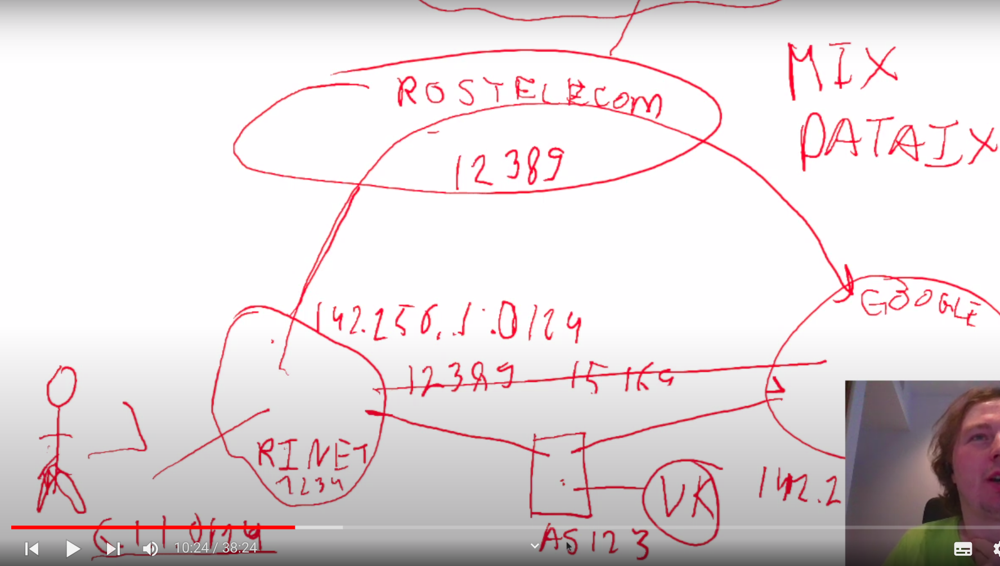
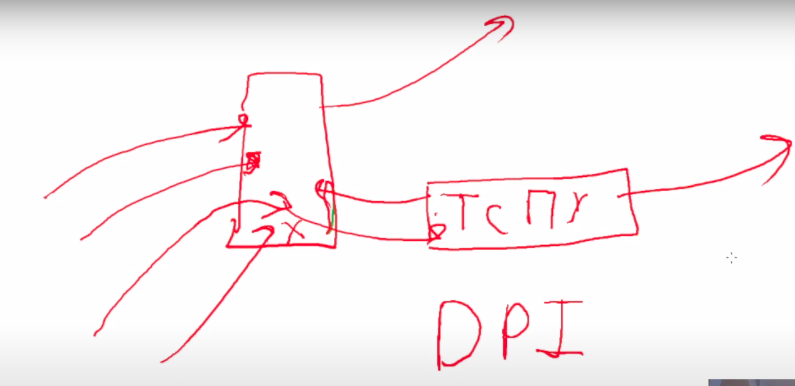
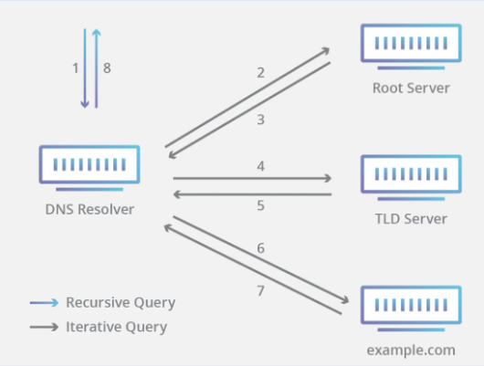
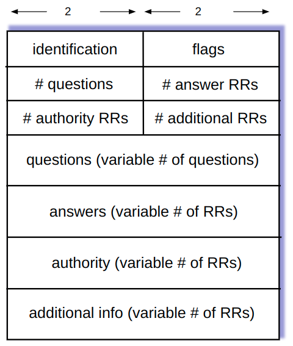
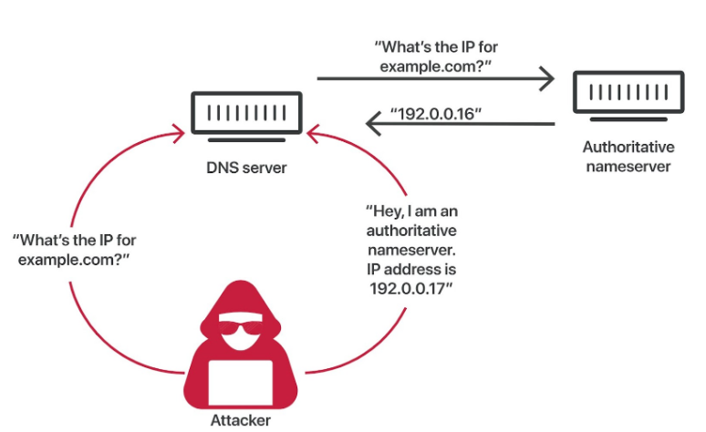

# Конспект курса Компьютерные сети

# Лекция 6
[YouTube](https://www.youtube.com/watch?v=iU1it7T93Tw&list=PLd7QXkfmSY7bh7nHfBbeQDIUUWueQja_4&index=6)

## Как выглядит интернет с точки зрения провайдера?


*TODO:* упомянуть термин BGP-сессия

Вы подключены к провайдеру (RiNet) и хотите получить доступ ко всему (или части) интернета. Как RiNet-у доставить до вас трафик?

**Важно: RiNet - [автономная система](https://ru.wikipedia.org/wiki/%D0%90%D0%B2%D1%82%D0%BE%D0%BD%D0%BE%D0%BC%D0%BD%D0%B0%D1%8F_%D1%81%D0%B8%D1%81%D1%82%D0%B5%D0%BC%D0%B0_(%D0%98%D0%BD%D1%82%D0%B5%D1%80%D0%BD%D0%B5%D1%82))**.

Допустим, вы хотите обмениваться трафиком с Google.

Есть три способа:
1. Подключить RiNet к большому провайдеру (Rostelecom), у которого есть *BGP FullView* (путь до любой другой автономной системы).
   - `+` Доступ в весь интернет
   - `-` И провайдер, и Google должны платить ростелекому.
2. Проложить кабель (например, оптику) напрямую между RiNet и Google. В таком случае они налаживают Пиринг (Peering).
   - `+` Скорость, короткий путь
   - `+` Не нужно платить ростелекому
   - `-` Прокладывать кабель сложно
   - `-` Не факт, RiNet настолько интересен Гуглу, чтобы он согласился соединить себя с ним.
3. Internet Exchange. Например MSK-IX, SPB-IX.
   - `+` Дешевле, чем через Ростелеком
   - `-` Доступ только до **части** сетей, ограниченный тем, кто подключен к данной точке IX.

### Как провайдер общается с далеко расположенными сетями (на другом континенте)?

Есть примерно 5 [тир-1 провайдеров](https://en.wikipedia.org/wiki/Tier_1_network). Среди них:
   - Cogent
   - Level 3
   - Cable & Wireless

Тир-1 провайдеры соединены друг с другом, и к ним подключены все в интернете, за деньги. Они предоставляют связность интернета.

Но пара провайдеров может сэкономить, и воспользоваться каким-нибудь IX. На сайте [hurricane electric](https://bgp.he.net/) можно посмотреть, к каким IX подключен, например, Ростелеком (и много всего другого).

## Блокировки
Большинство маленьких провайдеров соединены с "интернетом" через несколько больших провайдеров: МТС, Мегафон, Ростелеком. Поэтому популярная практика блокировать IP-адреса через этих больших провайдеров.

*Если у вас внезапно заработал Instagram, вполне возможно что у вашего провайдера есть стык с Facebook не через Ростелеком и т.п.*

### Как блокировать DNS?
1. Запросы к DNS-серверу очень легко отличить, и провайдер может отвечать вам просто непраивльным IP-адресом. Это можно обойти, используя *DNS over SSL*, *DNS over HTTPS*.
2. Провайдер может посмотреть, в какие адреса резолвится нежелательный сайт, и заблокировать их.
3. Бывает так, что на одном IP-адресе распологается несколько сайтов, и хочется блокировать лишь некоторые из них. Для этого необходимо лезть внутри IP-пакета. HTTPs шифрует все, кроме названия сайта. Поэтому блокировщик может пофильтровать пакеты по вхождению названия.

   *Примечание: это зависит не только от вас, но и от сервера, к которому подключаетесь. Есть протоколы, позволяющие шифровать имя сайта, но они не распространены, поэтому пока что они не помогут.*
4. Использовать фрагментацию IP-пакетов, чтобы разрезать имя сайта и положить в два пакета.

### Как блокируют в зависимости от содержимого пакета?


**Технические средства противодействия угрозам**

Их могут подключать к провайдеру, и пропускать через них трафик. Дальше происходит [Deep Packet Inspection](https://en.wikipedia.org/wiki/Deep_packet_inspection). В случае срабатывания фильтра устройство сообщает провайдеру дропнуть данный пакет. Эти устройства видят то, что находится в IP-пакете.
- Если это HTTPS, то видны название сайта и IP-адрес получателя.
- Если HTTP, то видно все :)

Так работал великий китайский файрвол.

### Обход блокировок
**VPN**. В месте за пределами файрвола разворачивается VPN-сервер. Устанавливается соединение, эмулирующее линк на уровне L2, и уже оттуда отправляются пакеты. Стоит понимать, что VPN траффик довольно легко отличить от обычного. Поэтому его можно блокировать:
- Новые / маленькие VPN протоколы блокировать нетрудно
- Старые / большие, такие как IpSec, OpenVPN не блокируют, потому что ими пользуются компании, и ломать ничего не хочется.
- Всю сеть VPN-провайдера можно забанить по IP.

# Лекция 7 DNS

[Youtube](https://youtu.be/8H_9mKmiYSk)

DNS - Domain Name System

Основная его задача - преобразовывать строчку в IP-адрес:
```
neerc.ifmo.ru -> 77.234.215.132
```
Несколько правил названий сайтов:
- label <= 63 characters (между точками)
- name <= 254 characters (суммарно)
- [a-zA-Z0-9-]

**Имена регистро-независимые!**

## IDN (Internationalized domain name)
Кириллица и другие Unicode-символы транслируются с помощью IDN:
```
итмо.рф ~ xn--h1aigo.xn--p1ai
```

**Проблема**:
итмо.рф выглядит как итмo.рф, хотя в первом случае \`о\` русская, а во втором латинская.

**Решения**:
- В браузере при наличии символов разных "сортов" отображать преобразованную *idn*-ом строку вместо оригинальной, чтобы пользователь видел, что происходит что-то странное.
- Запретить микс букв, например в зоне `.ru` запрещена кириллица, а в зоне `.рф` запрещена латиница.
- Регистратор домена может отказываться регистрировать нехороший домен, но регистраторов много и достаточно хотя бы одного, который согласится

## Как можно реализовать DNS?
### Файл /etc/hosts
Просто текстовый файл, где для IP адресов указывается одно или несколько имен:

```
> cat /etc/hosts
127.0.0.1	localhost
127.0.1.1	sancho20021-ThinkPad-L390

# The following lines are desirable for IPv6 capable hosts
::1     ip6-localhost ip6-loopback
fe00::0 ip6-localnet
ff00::0 ip6-mcastprefix
ff02::1 ip6-allnodes
ff02::2 ip6-allrouters
```
- `+` Просто
- `-` Не масштабируется

**Что можно хранить в DNS? (Типы записей)**
- A - IPv4 address
- AAAA - Ipv6 address
- CNAME - Alias / синоним к другому имени
- PTR - Alias to another name, and don't resolve further
- TXT - Произвольный текст
- NXDOMAIN - Имя не существует (явно указываем отсутствие записи)
- MX - Mail server

## Как работает DNS на самом деле?

Иерархия:

Вершины дерева отвечают за **зоны**: доменные имена, заканчивающиеся на определенный суффикс.

Пусть есть neerc.ifmo.ru
1. Спрашиваем у корня, знает ли он IP адрес neerc.ifmo.ru. Он просит нас пойти на сервер, отвечающий за зону `.ru`.
2. Спрашиваем у `.ru` DNS-сервера.
3. И так далее

Есть 13 ~~праймов~~ root DNS-серверов, IP-адреса которых зашиты в ОС.

https://www.iana.org/domains/root/servers

Эти root-сервара должны знать про top-level домены (.com, .org, .net).

Домены стран, такие как `.ru`, `.us`, `.tv` хотя и могут использоваться не по назначению (а просто как красивый конец сайта), администрируются по правилам страны, которой принадлежат.

Сейчас можно создать произвольный домен первого уровня (`.footbal`, `.bar`, `.sex`), IANA возьмет деньги за создание и поддержание:

https://www.iana.org/domains/root/db

### Другие записи DNS
#### Resource Records

**NS**: зона менеджится другим сервером (знаю, куда пойти)

Glue records: информация об IP адресах DNS-серверов-детей, т.к. нам необходимо знать не только домен DNS-сервера, к которому идти дальше, но и его IP.

Пример - `additional section` в выводе команды
```
dig vk.com @c.root-servers.net
```

**SOA - Start of authority**

### Плохо было бы постоянно дергать root-сервера на каждый запрос.
Поэтому происходит кэширование.

Есть параметр TTL (Time to live), который говорит, насколько нужно закэшировать этот ответ.

*Большой TTL - часто спрашивают, но можно быстро перенести сервер, и через короткое время все об этом узнают.*

*Маленький TTL - закешируют, спрашивать не будут, но нужно заранее думать о переносе сервера*.

Можно кешировать ответ, что запись отсутствует (NXDOMAIN).

### Recursive resolvers

Определение IP-адреса - итеративный процесс, который долго выполнять вручную, поэтому существуют рекурсивные резолверы. Некоторые из них расположены в интернете (`8.8.4.4`). Они тоже кэшируют запросы.

Cписок резолверов на линуксе расположен в `/etc/resolv.conf`. Адрес DNS сервера обычно сообщается в опциях DHCP.

`search local` в `/etc/resolv.conf` означает, что нужно искать в зоне `.local`. В таком случае `hello` (без точек) порезолвится в `hello.local`.

## Reverse DNS
- 132.215.234.77.in-addr.arpa
- b.a.9.8.7.6.5.0.0.0.0.0.0.0.0.0.0.0.0.0.0.0.0.0.8.b.d.0.1.0.0.2.ip6.arpa

Есть зона `.arpa`, сделав специальный запрос к которой можно узнать, какому домену принадлежит заданный IP-адрес.

### Еще про записи в DNS
Утилите `dig` можно передать интересующий тип записи:
```
dig ifmo.ru ANY
```
ANY означает, что интересуют все типы. ANY - deprecated. Как минимум потому, что приходится отдавать очень много информации на такой запрос.

Чтобы проверить, что домент действительно принадлежит вам, вас могут попросить добавить специальную TXT запись.

`HINFO` - запись, описывающая, какой тип железа используется на DNS сервере.

## Технические детали протокола

- identification: число из двух байт, чтобы можно было сопостовлять запросы и ответы
- authority RRs: записи, идущие от сервера напрямую, а не рекурсивно через кого-то
### Поверх чего работает DNS?
Исторически поверх UDP, порт 53. Размер пакета ограничен 512 байтами. Как раз по этой причине корневых серверов 13, так как хочется, чтобы информация про всех влезла в UDP-пакет.

Если нужно передать больше информации, то в флажочках можно попросить переподключиться через TCP, порт 53.

Новые реализации DNS, появились в 21 веке:
- DNS over TLS (DoT)
  - RFC 7858
- DNS over HTTPS (DoH)
  - RFC 8484
  - DNS-запросы практически не отличить от обычных пакетов, поэтому блокировать непросто.

### EDNS(0)
Был свободный битик во флагах, поэтому решили при его выставлении расширить функционал DNS-а дополнительной информацией:
- Разрешается посылать UDP пакеты больше 512 байт
- EDNS Client Subnet: можно указать подсеть клиента

Пояснение про второе: Пусть вы хотите подключиться к `google.com`. Варианты:
1. Отправляете запрос близко расположенному резолверу, тот общается с гуглом, и гугл, понимая, где находится резолвер, возвращает наиболее близко расположенный сервер. :)
2. Через публичный рекурсивный далеко расположенный резолвер при выключенном EDNS Гуглу не удастся вернуть вам удобный по местоположению сервер, так как он не знает вашего IP. EDNS решает эту проблему.

## Уязвимости DNS

В DNS нет авторизации, поэтому злоумышленник может отправить вам собственный ответ на DNS-запрос. Но при этом он должен:
- Иметь правильный src адрес своего пакета, совпадающий с адресом DNS-сервера
- Подобрать `identefication` (поле в DNS-пакете)

Поэтому высока вероятность, что ответ от настоящего сервера придет быстрее, чем 65526 пробных пакетов злоумышленника.

Можно защититься от подобных атак:
- Нагнать энтропии в префикс домена (a.b.vk.com вместо vk.com): *я не уверен, что Сережа [именно это имел в виду](https://youtu.be/8H_9mKmiYSk?t=3687)*
- Использовать случайный кейсинг (большие и маленькие буквы в домене)

### DNS Cache poisoning

Пусть есть рекурсивный резолвер, расположенный по адресу 1.1.1.1, и мы хотим, чтобы он стал неправильно отвечать на запросы. Что можно сделать:
1. Отправить запрос на 1.1.1.1
2. Сразу же прислать свой ответ на 1.1.1.1
Вуаля, 1.1.1.1 загрузил наш ответ в кэш, и будет его всем рассылать какое-то время. Это работает (работало), потому что identefication при перенаправлении DNS-запроса принятно не менять.

Как защищаются:
- Меняют identefication при отправке запроса на следующий DNS-сервер
- Добавляют энтропии в запрос

## DNSSEC (Domain Name System Security Extensions)
Все предыдущие методы защиты все еще достаточно слабые. Поэтому давайте навесим криптографию на DNS.
- RRSIG - подпись, которая может стоять после любой записи в DNS-пакете
- DNSSEC - запись о вашем публичном ключе (и подпись предком).
- DS - DNSSEC delegation to another zone. Похоже на NS (запись о сервере, отвечающем о подзоне), но только с доп. криптографией для идентефикации сервера, кому делегируется запрос.
- NSEC/NSEC3 - Name doesn't exist. Сейчас используется NSEC3, потому что NSEC давал слишком много информации.

Теперь ответы будут подписываться приватным ключом сервера. Но чтобы удостовериться, что сервер "хороший", его публичный ключ подписывается приватным ключом сервером на уровень выше. И так далее вплоть до корневого.

**Использовать ли DNSSEC на вашем домене?**

Смотря какие у вас цели.

- Если да, то будете хорошо защищены от злоумышленников, но будьте готовы, что пользователи, не обновившие нужные ключи, не смогут достучаться до вашего сайта, пока не отключат валидацию DNSSEC
- Если нет, то защита пропадет, однако любой пользователь сможет зайти на ваш сайт

## Zone Transfer
AXFR - request zone transfer

За зону могут отвечать несколько серверов, и исторически был способ скопировать всю информацию с одного сервера на другой - Zone Transfer. Но люди поняли, что такая процедура нежелательна, и перестали ее поддерживать.

## Процедура получения домена
Есть две сущности:
1. Оператор зоны (`.com`). Он менеджит запросы к зоне `.com`, поддерживает список поддоменов.
2. Регистратор, к которому можно обратиться, чтобы он добавил ваш домен в зону `.com`. Платят за создание домена (небольшая сумма) и за продление. Бессрочно зарезервировать домен нельзя.

Оператор `.com` поддерживает только `NS` записи, то есть перенаправление DNS-запроса на указанный сервер. Часто бывает, что вы хотите захостить лишь один сайт, поэтому вы можете обратиться к регистратору, чтобы использовать его DNS-сервер, а не создавать собственный.

Но в то же время никто не запрещает вам запустить собвственный DNS-сервер на купленном вами домене.

## Whois
Сервис, позволяющий получать много разной информации про домен. Зачастую за сервис отвечает та же компания, что отвечает за DNS зоны.

Туда входят:
- адрес, куда жаловаться на abuse
- Раньше whois писал адреса, телефоны владельца домена, но со временем прекратили.
```
> whois tankionline.com
Domain Name: TANKIONLINE.COM
Registry Domain ID: 1554737365_DOMAIN_COM-VRSN
Registrar WHOIS Server: whois.instra.net
Registrar URL: http://www.instra.com
Updated Date: 2022-04-20T16:50:02Z
Creation Date: 2009-05-07T05:46:10Z
Registry Expiry Date: 2023-05-07T05:46:10Z
Registrar: Instra Corporation Pty Ltd.
Registrar IANA ID: 1376
Registrar Abuse Contact Email: abuse@instra.com
Registrar Abuse Contact Phone: +61.397831800
Domain Status: clientTransferProhibited https://icann.org/epp#clientTransferProhibited
Name Server: NS-1375.AWSDNS-43.ORG
Name Server: NS-1714.AWSDNS-22.CO.UK
Name Server: NS-293.AWSDNS-36.COM
Name Server: NS-601.AWSDNS-11.NET
DNSSEC: unsigned
URL of the ICANN Whois Inaccuracy Complaint Form: https://www.icann.org/wicf/
```
